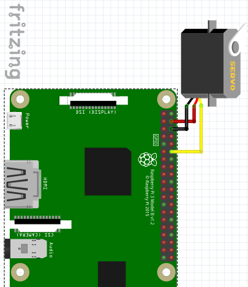
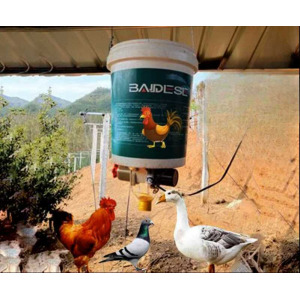

# 라즈베리파이 닭 먹이 자동 급여 시스템

라즈베리파이와 서보모터를 활용하여 정해진 시간에 자동으로 닭 먹이통을 개폐하는 시스템입니다.

## 주요 기능

- **자동 급여**: KST 시간 기준으로 설정된 시간에 자동으로 먹이통 개폐
- **설정 가능한 스케줄**: config.json 파일을 통해 급여 시간 및 지속시간 설정
- **로깅 시스템**: 모든 급여 이벤트 기록
- **서비스 모드**: systemd를 통한 부팅 시 자동 시작

## 하드웨어 요구사항

- 라즈베리파이 (3/4/Zero 모두 가능)
- 서보모터 (SG90 또는 호환 모델)
- 점퍼 와이어
- 외부 전원 (서보모터용, 권장)

## 핀 연결

```
서보모터 -> 라즈베리파이
- 빨간선(VCC) -> 5V (핀 2 또는 4)
- 갈색선(GND) -> GND (핀 6, 9, 14 등)
- 주황선(신호) -> GPIO 12 (물리적 핀 12)
```

### 라즈베리파이 핀맵


## 시스템 구성 예시


## 설치 방법

1. 저장소 클론 또는 파일 다운로드
```bash
cd /home/pyotel/src/chicken_feed
```

2. 실행 권한 부여 및 설치
```bash
chmod +x install.sh
./install.sh
```

## 설정 파일 (config.json)

```json
{
  "feeding_times": ["07:00", "12:00", "18:00"],  // 급여 시간 (KST)
  "feeding_duration_minutes": 30,                 // 먹이통 열림 시간 (분)
  "rotation_time": 10,                            // 모터 회전 시간 (초)
  "servo_stop_duty": 7.5,                         // 서보 정지 duty
  "servo_cw_duty": 9.75,                          // 시계방향 duty (열기)
  "servo_ccw_duty": 5.25                          // 반시계방향 duty (닫기)
}
```

### 연속 회전 서보 Duty 값 참조표

| Duty 값 | 동작 |
|---------|------|
| 5.0 | 시계 방향 최대 속도 |
| 6.5 | 시계 방향 느린 속도 |
| 7.5 | 정지 (중립) |
| 8.5 | 반시계 방향 느린 속도 |
| 10.0 | 반시계 방향 최대 속도 |

- 시계방향(CW): 5.0 ~ 7.5 (값이 작을수록 빠름)
- 반시계방향(CCW): 7.5 ~ 10.0 (값이 클수록 빠름)

## 사용 방법

### 서보모터 테스트
```bash
sudo python3 test_servo.py
```

### 수동 실행
```bash
sudo python3 chicken_feeder.py
```

### 서비스로 실행
```bash
# 서비스 시작
sudo systemctl start chicken-feeder

# 서비스 중지
sudo systemctl stop chicken-feeder

# 서비스 상태 확인
sudo systemctl status chicken-feeder

# 로그 실시간 확인
sudo journalctl -u chicken-feeder -f
```

## 파일 구조

- `chicken_feeder.py`: 메인 프로그램
- `config.json`: 설정 파일
- `test_servo.py`: 서보모터 테스트 도구
- `chicken-feeder.service`: systemd 서비스 파일
- `install.sh`: 설치 스크립트

## 문제 해결

### 서보모터가 움직이지 않을 때
1. 핀 연결 확인
2. 전원 공급 확인 (외부 전원 사용 권장)
3. `test_servo.py`로 동작 테스트

### 시간이 맞지 않을 때
```bash
# 시스템 시간 확인
date

# 시간대 설정
sudo timedatectl set-timezone Asia/Seoul
```

### 로그 파일 권한 문제
```bash
sudo chown $USER:$USER /var/log/chicken_feeder.log
```

## 주의사항

- 서보모터는 많은 전력을 소비하므로 외부 전원 사용을 권장합니다
- 먹이통 무게를 고려하여 충분한 토크의 서보모터를 선택하세요
- 실외 사용 시 방수 처리가 필요합니다